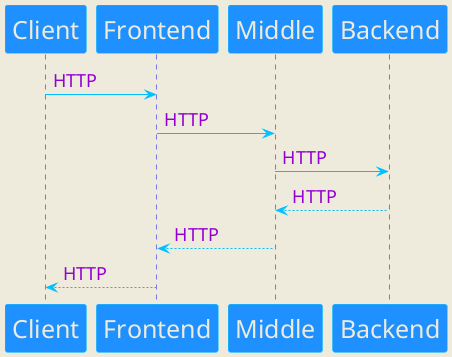

# Telegram-бот
Telegram-бот является Frontend компонентом проекта "Мини-банк". Бот выполняет функцию клиентского приложения, 
отправляя запросы пользователей к Java-сервису (второму компоненту проекта)

### Подготовка к запуску бота
1. Склонировать проект
2. Внести имя и токен вашего Telegram бота в src/main/resources/application.yml
### Локальный запуск через Intellij Idea
1. Выбрать файл src/main/java/ru/satvaldiev/telegrambot/TelegramBotApplication.java
2. Нажать зеленый треугольник слева от имени класса
### Локальный запуск через консоль
1. Перейти в корневую папку проекта
2. Выполнить команды ___./gradlew --stop___ и ___./gradlew clean build___
3. Перейти в папку build/libs/
4. Выполнить команду ___java -jar TelegramBot-0.0.1-SNAPSHOT.jar___
### Поддерживаемые команды бота
- ___/start___ (ответ - "Привет, firstName!")
- ___/stop___ (ответ - "Пока, firstName!")
- ___/ping___ (ответ - "pong")