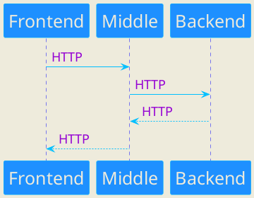
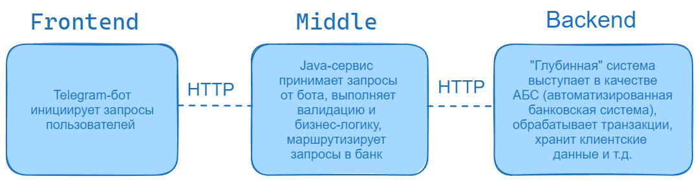

# Telegram-бот
Telegram-бот является Frontend компонентом проекта "Мини-банк". Бот выполняет функцию клиентского приложения, 
отправляя запросы пользователей к Java-сервису (второму компоненту проекта)

