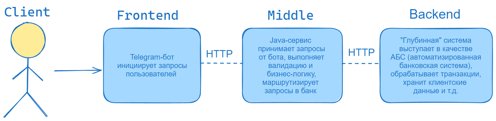

# Telegram-бот
Telegram-бот является Frontend компонентом проекта "Мини-банк". Бот выполняет функцию клиентского приложения, 
отправляя запросы пользователей к Java-сервису (второму компоненту проекта)





### Локальный запуск 
1. Склонировать проект
   ```
   git clone https://github.com/gpb-it-factory/satvaldiev-telegram-bot.git
   ```
2. Перейти в корневую папку проекта ___satvaldiev-telegram-bot___
3. Выполнить команду в Windows PowerShell (вместо ___bot_name___ и ___bot_token___ прописать ваши креды):
   ```
   $Env:BOT_NAME = "bot_name"; $Env:BOT_TOKEN = "bot_token"; ./gradlew bootRun
   ```
4. Если через bash, то выполнить команду (вместо ___bot_name___ и ___bot_token___ прописать ваши креды): 
   ```
   BOT_NAME={bot_name} BOT_TOKEN={bot_token} ./gradlew bootRun
   ```


### Поддерживаемые команды бота
- ___/start___ (ответ - "Привет, firstName!")
- ___/stop___ (ответ - "Пока, firstName!")
- ___/ping___ (ответ - "pong")
- ___/register___ (ответ - "Поздравляем! Вы стали клиентом нашего банка")